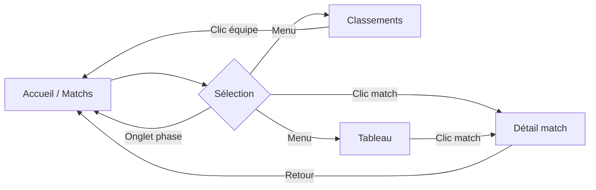

# Conception de l'interface utilisateur (Front-end)

**Projet :** Application de suivi de la Coupe du monde FIFA 2026  
**Stack UI :** Next.js, Tailwind CSS, Lucide Icons  
**Références :** `03-cdc-fonctionnel.md`, `conception/uml/01-diagrammes-uml.md`

---

## 1. Écrans principaux

| Écran | Route prévue | Fonctionnalités liées |
| ----- | ------------ | --------------------- |
| Liste des matchs | `/matches` | F01, F02, F04, F07 |
| Détail d'un match | `/matches/[id]` | F03, F04, F07 |
| Classements | `/standings` | F05 |
| Tableau éliminatoire | `/bracket` | F06 |

---

## 2. Zonings

Structure commune à tous les écrans (layout global).

```
┌─────────────────────────────────────────────────────────┐
│  ZONE A — En-tête (Header)                              │
│  Logo · Titre app · Navigation principale               │
├─────────────────────────────────────────────────────────┤
│  ZONE B — Navigation secondaire (selon l'écran)         │
│  Onglets phases / groupes / fil d'Ariane                │
├─────────────────────────────────────────────────────────┤
│  ZONE C — Contenu principal                             │
│  Liste matchs · Détail · Tableaux · Bracket             │
├─────────────────────────────────────────────────────────┤
│  ZONE D — Pied de page (Footer)                         │
│  Mention CDM 2026 · lien GitHub (optionnel)             │
└─────────────────────────────────────────────────────────┘
```

### 2.1. Écran — Liste des matchs

| Zone | Éléments |
| ---- | -------- |
| **A — En-tête** | Logo, titre « CDM 2026 », liens : Matchs · Classements · Tableau |
| **B — Onglets phases** | Groupes · 1/16 · 1/8 · Quarts · Demis · Petite finale · Finale |
| **C — Liste** | Cartes match empilées verticalement (scroll) |
| **D — Footer** | Texte légal / crédits |

### 2.2. Écran — Détail d'un match

| Zone | Éléments |
| ---- | -------- |
| **A — En-tête** | Identique au layout global |
| **B — Fil d'Ariane** | Matchs > [Phase] > [Équipe A vs Équipe B] |
| **C — Bloc match** | Équipes, score central, statut, date/heure, stade |
| **C' — Timeline** *(optionnel)* | Chronologie des buts |
| **D — Footer** | Identique |

### 2.3. Écran — Classements

| Zone | Éléments |
| ---- | -------- |
| **A — En-tête** | Layout global |
| **B — Sélecteur groupes** | Onglets A · B · C · D · E · F… |
| **C — Tableau** | Colonnes : Équipe, J, V, N, D, DB, Pts |
| **D — Footer** | Identique |

### 2.4. Écran — Tableau éliminatoire

| Zone | Éléments |
| ---- | -------- |
| **A — En-tête** | Layout global |
| **B — Légende** | Codes couleur statuts |
| **C — Bracket** | Arborescence simplifiée 1/16 → Finale |
| **D — Footer** | Identique |

---

## 3. Wireframes

### 3.1. Liste des matchs

```
┌──────────────────────────────────────────┐
│ ⚽ CDM 2026    Matchs  Classements  📊  │
├──────────────────────────────────────────┤
│ [Groupes][1/16][1/8][Quarts][Demis][Fin] │
├──────────────────────────────────────────┤
│ ┌──────────────────────────────────────┐ │
│ │ 🇫🇷 France    2 - 1    🇩🇪 Allemagne │ │
│ │ 15 juin · 21:00        ● En cours    │ │
│ └──────────────────────────────────────┘ │
│ ┌──────────────────────────────────────┐ │
│ │ 🇧🇷 Brésil    -  -     🇦🇷 Argentine│ │
│ │ 16 juin · 18:00        ○ À venir     │ │
│ └──────────────────────────────────────┘ │
│ ┌──────────────────────────────────────┐ │
│ │ 🇪🇸 Espagne   1 - 3    🇵🇹 Portugal  │ │
│ │ 14 juin · Terminé      ✓ Terminé     │ │
│ └──────────────────────────────────────┘ │
├──────────────────────────────────────────┤
│           © Coupe du monde 2026          │
└──────────────────────────────────────────┘
```

### 3.2. Détail d'un match

```
┌──────────────────────────────────────────┐
│ ⚽ CDM 2026    Matchs  Classements  📊  │
├──────────────────────────────────────────┤
│ ← Retour   Matchs > Quarts > FRA vs GER │
├──────────────────────────────────────────┤
│                                          │
│           Phase : Quarts de finale       │
│                                          │
│    🇫🇷          2  -  1          🇩🇪     │
│   France                        Allemagne│
│                                          │
│         ● EN COURS · 67'                 │
│                                          │
│   📅 15 juin 2026 · 21:00               │
│   🏟 MetLife Stadium · East Rutherford   │
│                                          │
│ ─── Buts ──────────────────────────────  │
│   23'  Mbappé (FRA)                      │
│   45'  Müller (GER)                      │
│   61'  Griezmann (FRA)                   │
│                                          │
└──────────────────────────────────────────┘
```

### 3.3. Classements

```
┌──────────────────────────────────────────┐
│ ⚽ CDM 2026    Matchs  Classements  📊  │
├──────────────────────────────────────────┤
│  [A]  [B]  [C]  [D]  [E]  [F]  [G]  [H]  │
├──────────────────────────────────────────┤
│ Équipe      J   V   N   D   DB   Pts     │
│ ─────────────────────────────────────── │
│ 🇫🇷 France   3   2   1   0   +4    7     │
│ 🇦🇺 Australie 3  1   1   1   -1    4     │
│ 🇩🇰 Danemark  3   1   1   1   -2    4     │
│ 🇹🇳 Tunisie   3   0   1   2   -1    1     │
└──────────────────────────────────────────┘
```

### 3.4. Tableau éliminatoire (simplifié)

```
┌──────────────────────────────────────────┐
│ ⚽ CDM 2026    Matchs  Classements  📊  │
├──────────────────────────────────────────┤
│                                          │
│  1/8          Quarts         Demis       │
│ ┌─────┐      ┌─────┐       ┌─────┐      │
│ │FRA 2│──┐   │     │       │     │      │
│ │GER 1│  ├──►│ ?   │──┐    │     │      │
│ └─────┘  │   └─────┘  │    └─────┘      │
│ ┌─────┐  │              │                │
│ │BRA 1│──┘              ▼                │
│ │ARG 2│            ┌─────────┐           │
│ └─────┘            │  FINALE │           │
│                    └─────────┘           │
└──────────────────────────────────────────┘
```

### 3.5. Parcours utilisateur



---

## 4. Charte graphique

### 4.1. Couleurs

| Rôle | Nom | Hex | Usage |
| ---- | --- | --- | ----- |
| Primaire | Bleu CDM | `#1E3A5F` | En-tête, liens actifs, titres |
| Secondaire | Or trophée | `#F5A623` | Accents, logo, CTA |
| Fond clair | Blanc cassé | `#F8FAFC` | Arrière-plan pages |
| Fond carte | Blanc | `#FFFFFF` | Cartes match, tableaux |
| Texte principal | Anthracite | `#1E293B` | Corps de texte |
| Texte secondaire | Gris | `#64748B` | Dates, labels |
| Statut — à venir | Bleu | `#3B82F6` | Badge « À venir » |
| Statut — en cours | Vert | `#22C55E` | Badge « En cours », score live |
| Statut — terminé | Gris | `#94A3B8` | Badge « Terminé » |
| Erreur | Rouge | `#EF4444` | Messages d'erreur |
| Mode sombre — fond | Ardoise | `#0F172A` | Fond dark *(optionnel)* |

### 4.2. Typographies

| Usage | Police | Taille | Poids |
| ----- | ------ | ------ | ----- |
| Titre app | Inter | 20px | 700 (bold) |
| Titres de section | Inter | 18px | 600 (semibold) |
| Score match | Inter | 28–36px | 700 |
| Noms d'équipes | Inter | 16px | 500 |
| Corps / métadonnées | Inter | 14px | 400 |
| Labels tableau | Inter | 12px | 500 |

*Inter* est chargée via `next/font` (Google Fonts). Fallback : system-ui, sans-serif.

### 4.3. Icônes

| Besoin | Icône Lucide |
| ------ | ------------ |
| Football / app | `Trophy` |
| Date | `Calendar` |
| Stade | `MapPin` |
| Retour | `ArrowLeft` |
| En cours (live) | `Radio` ou point animé |
| Erreur | `AlertCircle` |
| Chargement | `Loader2` (spin) |

### 4.4. Composants récurrents

| Composant | Style |
| --------- | ----- |
| **Carte match** | Fond blanc, `rounded-xl`, ombre légère, padding 16px, hover légère élévation |
| **Badge statut** | Pill arrondi, fond coloré à 10 % opacité, texte couleur statut |
| **Onglet phase** | Texte 14px, souligné ou fond plein si actif (bleu primaire) |
| **Bouton retour** | Texte + icône, couleur primaire |
| **Tableau** | Lignes alternées gris très clair, en-tête fond bleu primaire texte blanc |

### 4.5. Espacements et grille

- Marges page : `16px` mobile · `24px` desktop
- Espacement cartes : `12px` vertical
- Largeur max contenu : `768px` (mobile-first, centré sur desktop)
- Breakpoints Tailwind : `sm` 640px · `md` 768px · `lg` 1024px

---

## 5. Maquettes graphiques

Description détaillée des écrans principaux selon la charte.

### 5.1. Carte match (composant clé)

```
┌─────────────────────────────────────────────┐
│  fond: #FFFFFF · border-radius: 12px        │
│  shadow: 0 1px 3px rgba(0,0,0,0.1)          │
│                                             │
│  🇫🇷  France          2  -  1    Allemagne 🇩🇪│
│       ↑ Inter 16px medium    ↑ Inter 28px bold│
│                                             │
│  📅 15 juin 2026 · 21:00    [● En cours]    │
│       ↑ gris #64748B         ↑ vert #22C55E │
└─────────────────────────────────────────────┘
```

### 5.2. Page détail — match en cours

| Zone | Rendu visuel |
| ---- | ------------ |
| Fond page | `#F8FAFC` |
| Bloc central | Carte blanche large, score `36px` centré |
| Équipes | Drapeaux 48px de chaque côté du score |
| Badge live | Vert `#22C55E`, texte « EN COURS », point pulsant |
| Infos match | Icônes calendrier + stade, texte gris secondaire |
| Timeline buts | Liste verticale, minute en gras, nom joueur en regular |

### 5.3. En-tête global

```
┌─────────────────────────────────────────────────────────┐
│ fond: #1E3A5F (bleu primaire) · texte: #FFFFFF          │
│                                                         │
│  🏆 CDM 2026          Matchs   Classements   Tableau    │
│  ↑ or #F5A623           ↑ lien actif = souligné or      │
└─────────────────────────────────────────────────────────┘
```

### 5.4. États de l'interface

| État | Affichage |
| ---- | --------- |
| **Chargement** | Skeleton gris animé à la place des cartes |
| **Erreur API** | Bandeau rouge clair, icône alerte, texte « Impossible de charger les données », bouton « Réessayer » |
| **Liste vide** | Illustration légère + « Aucun match pour cette phase » |
| **Match à venir** | Score masqué, affiché « vs » entre les équipes |

---

## 6. Cohérence avec les autres conceptions

| Fonctionnel | UI |
| ----------- | -- |
| F01 — Phases | Onglets zone B (liste matchs) |
| F02 — Liste matchs | Cartes zone C |
| F03 — Détail | Page `/matches/[id]` |
| F04 — Temps réel | Badge vert + score mis à jour (polling) |
| F05 — Classements | Page `/standings`, tableau |
| F06 — Tableau | Page `/bracket`, arborescence |
| F07 — Navigation | Header + fil d'Ariane + retour |
| F08 — Ergonomie | Charte couleurs, responsive, états |

| MERISE | UI |
| ------ | -- |
| MATCH (statut, score) | Carte match + page détail |
| EQUIPE (nom, drapeau) | Affichage sur chaque carte |
| CLASSEMENT | Tableau classements |
| PHASE | Onglets de navigation |