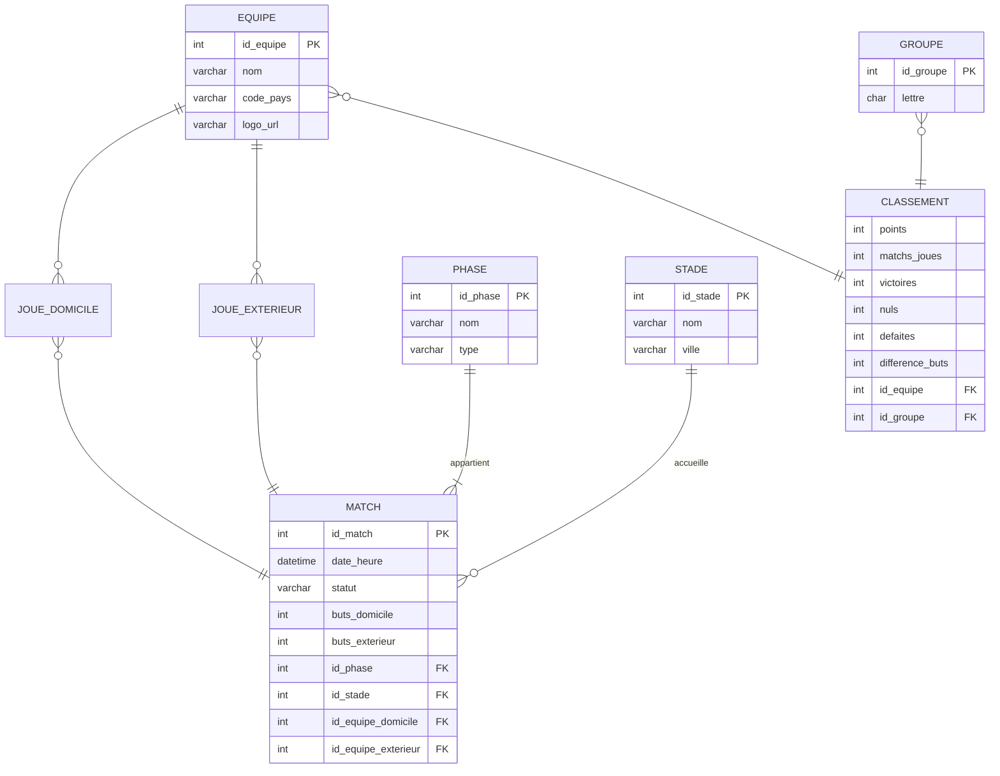

# Conception de la base de données — Méthode MERISE

**Projet :** Application de suivi de la Coupe du monde FIFA 2026  
**SGBD cible :** PostgreSQL  
**Références :** `conception/uml/01-diagrammes-uml.md`, `04-cdc-technique.md`

> En V1, l'application consomme une API externe sans persistance locale. Ce modèle décrit la structure logique des données, exploitable pour un cache BDD ou une évolution future.

---

## 1. MCD — Modèle Conceptuel de Données

### 1.1. Entités

| Entité | Identifiant | Attributs |
| ------ | ----------- | --------- |
| **EQUIPE** | `#id_equipe` | nom, code_pays, logo_url |
| **PHASE** | `#id_phase` | nom, type |
| **STADE** | `#id_stade` | nom, ville |
| **GROUPE** | `#id_groupe` | lettre |
| **MATCH** | `#id_match` | date_heure, statut, buts_domicile, buts_exterieur |

### 1.2. Associations

| Association | Entités liées | Cardinalités | Attributs propres |
| ----------- | ------------- | ------------ | ----------------- |
| **JOUE** | EQUIPE ↔ MATCH | (1,1) — (0,n) par rôle | Rôles : `domicile`, `exterieur` (2 équipes par match) |
| **APPARTIENT** | PHASE ↔ MATCH | (1,1) — (0,n) | — |
| **SE_DEROULE_A** | STADE ↔ MATCH | (0,1) — (0,n) | — |
| **CLASSE_DANS** | EQUIPE ↔ GROUPE | (0,n) — (0,n) | points, matchs_joues, victoires, nuls, defaites, difference_buts |

L'association **CLASSE_DANS** est une association avec attributs (classement d'une équipe dans un groupe).

### 1.3. Schéma MCD



### 1.4. Règles métier

- Un **MATCH** oppose exactement **2 équipes** (domicile et extérieur).
- Un **MATCH** appartient à **une seule PHASE**.
- Un **STADE** peut être inconnu (association optionnelle).
- Le **statut** d'un match : `a_venir`, `en_cours`, `termine`.
- Un **CLASSEMENT** est unique par couple (équipe, groupe).

---

## 2. MLD — Modèle Logique de Données

Transformation du MCD en tables relationnelles (3FN).

### 2.1. Tables

```
EQUIPE (#id_equipe, nom, code_pays, logo_url)

PHASE (#id_phase, nom, type)

STADE (#id_stade, nom, ville)

GROUPE (#id_groupe, lettre)

MATCH (#id_match, date_heure, statut, buts_domicile, buts_exterieur,
       %id_phase, %id_stade, %id_equipe_domicile, %id_equipe_exterieur)

CLASSEMENT (#id_equipe, #id_groupe, points, matchs_joues, victoires, nuls, defaites, difference_buts)
```

`#` = clé primaire · `%` = clé étrangère

### 2.2. Clés et contraintes

| Table | Clé primaire | Clés étrangères |
| ----- | ------------ | --------------- |
| EQUIPE | id_equipe | — |
| PHASE | id_phase | — |
| STADE | id_stade | — |
| GROUPE | id_groupe | — |
| MATCH | id_match | id_phase → PHASE, id_stade → STADE, id_equipe_domicile → EQUIPE, id_equipe_exterieur → EQUIPE |
| CLASSEMENT | (id_equipe, id_groupe) | id_equipe → EQUIPE, id_groupe → GROUPE |

### 2.3. Normalisation

| Forme | Vérification |
| ----- | ------------ |
| 1FN | Tous les attributs sont atomiques (pas de listes dans un champ) |
| 2FN | Pas de dépendance partielle (CLASSEMENT : clé composée, attributs dépendent des deux) |
| 3FN | Pas de dépendance transitive (nom de l'équipe dans EQUIPE, pas dans MATCH) |

Le score est intégré dans **MATCH** (buts_domicile, buts_exterieur) plutôt qu'en table séparée : relation 1,1 avec le match, pas de redondance.

---

## 3. MPD — Modèle Physique de Données (PostgreSQL)

### 3.1. Script de création

```sql
CREATE TABLE equipe (
    id_equipe       SERIAL PRIMARY KEY,
    nom             VARCHAR(100) NOT NULL,
    code_pays       CHAR(3) NOT NULL,
    logo_url        VARCHAR(255)
);

CREATE TABLE phase (
    id_phase        SERIAL PRIMARY KEY,
    nom             VARCHAR(50) NOT NULL,
    type            VARCHAR(30) NOT NULL
        CHECK (type IN ('groupes', 'seizieme', 'huitieme', 'quart',
                        'demi', 'petite_finale', 'finale'))
);

CREATE TABLE stade (
    id_stade        SERIAL PRIMARY KEY,
    nom             VARCHAR(100) NOT NULL,
    ville           VARCHAR(100)
);

CREATE TABLE groupe (
    id_groupe       SERIAL PRIMARY KEY,
    lettre          CHAR(1) NOT NULL UNIQUE
);

CREATE TABLE match (
    id_match        SERIAL PRIMARY KEY,
    date_heure      TIMESTAMPTZ NOT NULL,
    statut          VARCHAR(20) NOT NULL DEFAULT 'a_venir'
        CHECK (statut IN ('a_venir', 'en_cours', 'termine')),
    buts_domicile   SMALLINT DEFAULT 0 CHECK (buts_domicile >= 0),
    buts_exterieur  SMALLINT DEFAULT 0 CHECK (buts_exterieur >= 0),
    id_phase        INTEGER NOT NULL REFERENCES phase(id_phase),
    id_stade        INTEGER REFERENCES stade(id_stade),
    id_equipe_domicile   INTEGER NOT NULL REFERENCES equipe(id_equipe),
    id_equipe_exterieur  INTEGER NOT NULL REFERENCES equipe(id_equipe),
    CHECK (id_equipe_domicile <> id_equipe_exterieur)
);

CREATE TABLE classement (
    id_equipe       INTEGER NOT NULL REFERENCES equipe(id_equipe),
    id_groupe       INTEGER NOT NULL REFERENCES groupe(id_groupe),
    points          SMALLINT NOT NULL DEFAULT 0 CHECK (points >= 0),
    matchs_joues    SMALLINT NOT NULL DEFAULT 0 CHECK (matchs_joues >= 0),
    victoires       SMALLINT NOT NULL DEFAULT 0,
    nuls            SMALLINT NOT NULL DEFAULT 0,
    defaites        SMALLINT NOT NULL DEFAULT 0,
    difference_buts SMALLINT NOT NULL DEFAULT 0,
    PRIMARY KEY (id_equipe, id_groupe)
);

CREATE INDEX idx_match_phase ON match(id_phase);
CREATE INDEX idx_match_date ON match(date_heure);
CREATE INDEX idx_match_statut ON match(statut);
```

### 3.2. Index

| Index | Table | Colonne(s) | Justification |
| ----- | ----- | ---------- | ------------- |
| idx_match_phase | match | id_phase | Filtrage par phase (F01) |
| idx_match_date | match | date_heure | Tri chronologique |
| idx_match_statut | match | statut | Filtrage matchs en cours (temps réel) |

---

## 4. Dictionnaire de données

### 4.1. EQUIPE

| Attribut | Type | Taille | Min | Max | Description | Contraintes | Format |
| -------- | ---- | ------ | --- | --- | ----------- | ----------- | ------ |
| id_equipe | ENTIER | — | 1 | — | Identifiant unique | PK, auto-incrément | — |
| nom | CHAÎNE | 100 | — | — | Nom de la sélection | NOT NULL | Texte libre |
| code_pays | CHAÎNE | 3 | — | — | Code pays FIFA | NOT NULL | ISO 3166-1 alpha-3 (ex. FRA) |
| logo_url | CHAÎNE | 255 | — | — | URL du drapeau/logo | NULL autorisé | URL |

### 4.2. PHASE

| Attribut | Type | Taille | Min | Max | Description | Contraintes | Format |
| -------- | ---- | ------ | --- | --- | ----------- | ----------- | ------ |
| id_phase | ENTIER | — | 1 | — | Identifiant unique | PK, auto-incrément | — |
| nom | CHAÎNE | 50 | — | — | Libellé affiché | NOT NULL | ex. « Huitièmes de finale » |
| type | CHAÎNE | 30 | — | — | Code interne de la phase | NOT NULL, CHECK | groupes, huitieme, finale… |

### 4.3. STADE

| Attribut | Type | Taille | Min | Max | Description | Contraintes | Format |
| -------- | ---- | ------ | --- | --- | ----------- | ----------- | ------ |
| id_stade | ENTIER | — | 1 | — | Identifiant unique | PK, auto-incrément | — |
| nom | CHAÎNE | 100 | — | — | Nom du stade | NOT NULL | Texte libre |
| ville | CHAÎNE | 100 | — | — | Ville hôte | NULL autorisé | Texte libre |

### 4.4. GROUPE

| Attribut | Type | Taille | Min | Max | Description | Contraintes | Format |
| -------- | ---- | ------ | --- | --- | ----------- | ----------- | ------ |
| id_groupe | ENTIER | — | 1 | — | Identifiant unique | PK, auto-incrément | — |
| lettre | CARACTÈRE | 1 | — | — | Lettre du groupe | NOT NULL, UNIQUE | A, B, C… |

### 4.5. MATCH

| Attribut | Type | Taille | Min | Max | Description | Contraintes | Format |
| -------- | ---- | ------ | --- | --- | ----------- | ----------- | ------ |
| id_match | ENTIER | — | 1 | — | Identifiant unique | PK, auto-incrément | — |
| date_heure | DATE-HEURE | — | — | — | Date et heure du coup d'envoi | NOT NULL | TIMESTAMPTZ |
| statut | CHAÎNE | 20 | — | — | État du match | NOT NULL, CHECK | a_venir, en_cours, termine |
| buts_domicile | ENTIER | — | 0 | — | Buts équipe domicile | DEFAULT 0 | Entier positif |
| buts_exterieur | ENTIER | — | 0 | — | Buts équipe extérieur | DEFAULT 0 | Entier positif |
| id_phase | ENTIER | — | 1 | — | Phase de la compétition | FK → PHASE, NOT NULL | — |
| id_stade | ENTIER | — | 1 | — | Stade du match | FK → STADE, NULL autorisé | — |
| id_equipe_domicile | ENTIER | — | 1 | — | Équipe à domicile | FK → EQUIPE, NOT NULL | — |
| id_equipe_exterieur | ENTIER | — | 1 | — | Équipe à l'extérieur | FK → EQUIPE, NOT NULL | ≠ domicile |

### 4.6. CLASSEMENT

| Attribut | Type | Taille | Min | Max | Description | Contraintes | Format |
| -------- | ---- | ------ | --- | --- | ----------- | ----------- | ------ |
| id_equipe | ENTIER | — | 1 | — | Équipe classée | PK (composée), FK → EQUIPE | — |
| id_groupe | ENTIER | — | 1 | — | Groupe concerné | PK (composée), FK → GROUPE | — |
| points | ENTIER | — | 0 | — | Points au classement | NOT NULL, DEFAULT 0 | 0, 1 ou 3 par match |
| matchs_joues | ENTIER | — | 0 | — | Nombre de matchs joués | NOT NULL, DEFAULT 0 | Entier positif |
| victoires | ENTIER | — | 0 | — | Nombre de victoires | NOT NULL, DEFAULT 0 | Entier positif |
| nuls | ENTIER | — | 0 | — | Nombre de nuls | NOT NULL, DEFAULT 0 | Entier positif |
| defaites | ENTIER | — | 0 | — | Nombre de défaites | NOT NULL, DEFAULT 0 | Entier positif |
| difference_buts | ENTIER | — | — | — | Différence de buts | NOT NULL, DEFAULT 0 | Entier (peut être négatif) |

