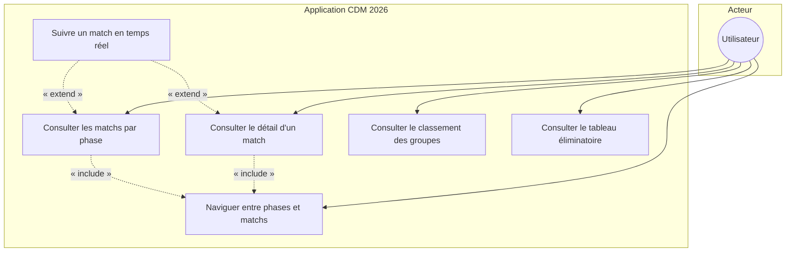
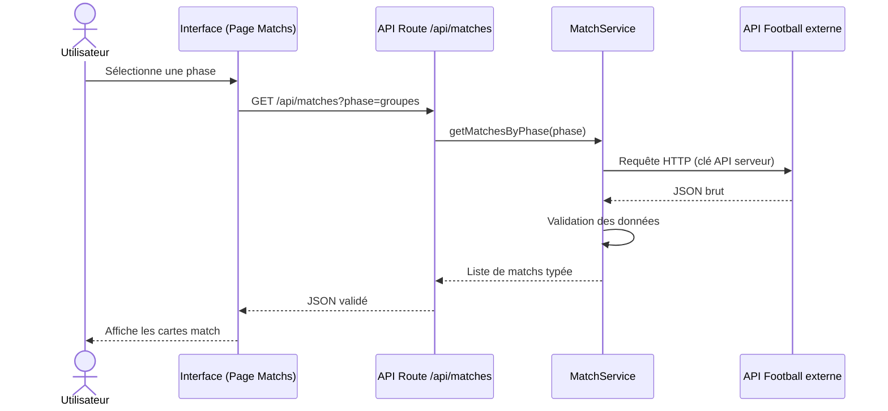
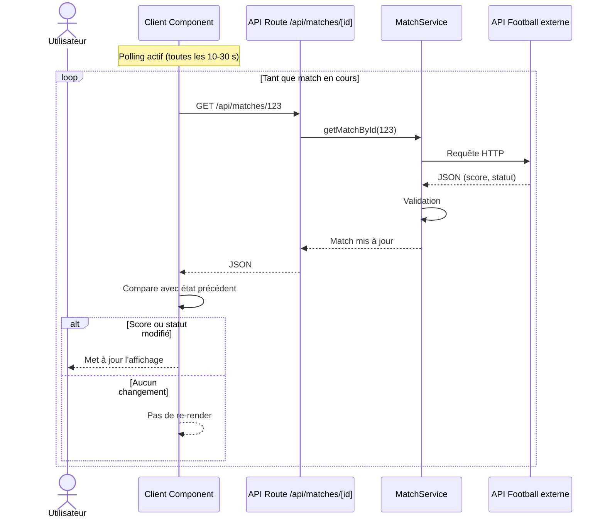
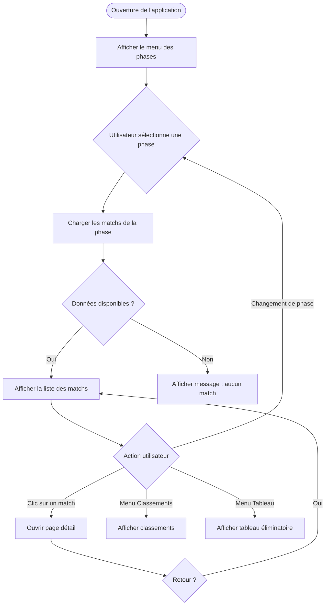
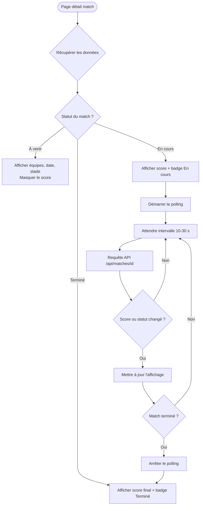
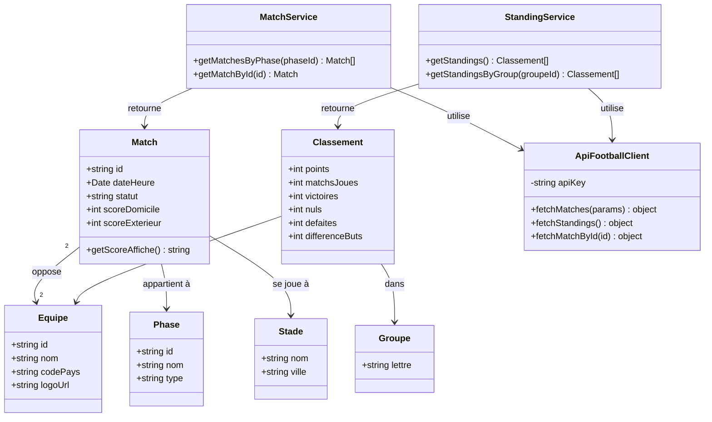
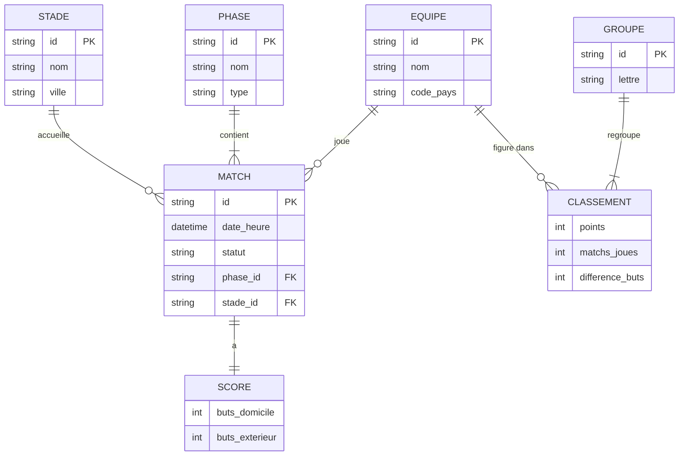

# Conception système — Diagrammes UML

---

## 1. Diagramme de cas d'utilisation

**Acteur :** Utilisateur (supporter, grand public)

| Cas d'utilisation | Description |
| ----------------- | ----------- |
| Consulter les matchs par phase | Filtrer et afficher les matchs d'une phase (groupes → finale) |
| Consulter le détail d'un match | Afficher équipes, date, stade, score, statut |
| Suivre un match en temps réel | Mise à jour automatique du score et du statut (polling) |
| Consulter le classement des groupes | Tableau des groupes (points, matchs joués, etc.) |
| Consulter le tableau éliminatoire | Visualiser les phases finales |
| Naviguer entre phases et matchs | Parcours menu → liste → détail → retour |

---

## 2. Diagrammes de séquence

### 2.1. Consultation d'une liste de matchs

### 2.2. Mise à jour en temps réel d'un score

---

## 3. Diagrammes d'activité

### 3.1. Navigation entre les phases

### 3.2. Affichage d'un match en cours

---

## 4. Diagramme de classes

Modèle applicatif (domaine + services). Les composants UI React ne sont pas détaillés ici.

---

## 5. Diagramme des entités

Entités métier alignées avec la future conception MERISE (MCD).

| Entité | Description |
| ------ | ----------- |
| EQUIPE | Sélection nationale participante |
| MATCH | Rencontre entre deux équipes |
| SCORE | Résultat d'un match (buts domicile / extérieur) |
| PHASE | Étape de la compétition (groupes, 1/8, finale…) |
| STADE | Lieu du match |
| GROUPE | Poule de la phase de groupes |
| CLASSEMENT | Position d'une équipe dans un groupe |

---

## 6. Cohérence entre les diagrammes

| Élément | Cas d'utilisation | Séquence | Classes | Entités |
| ------- | ----------------- | -------- | ------- | ------- |
| Consultation matchs | UC1 | § 2.1 | MatchService | MATCH, PHASE |
| Temps réel | UC3 | § 2.2 | Match, polling UI | SCORE, statut MATCH |
| Classements | UC4 | — | StandingService | CLASSEMENT, GROUPE |
| Navigation | UC6 | Activité § 3.1 | — | — |
